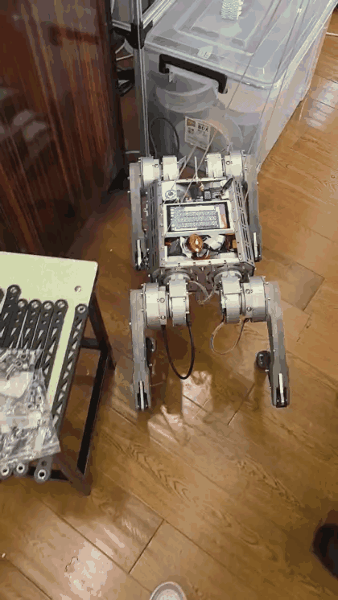
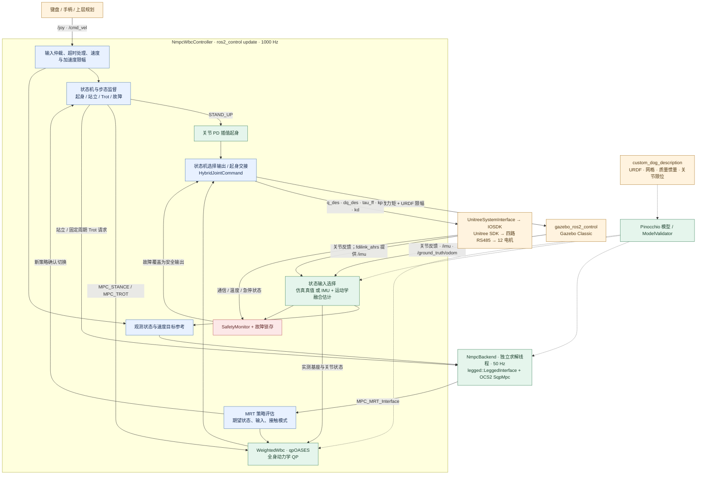

# Dog-control · 传统 NMPC / WBC 运控

**简体中文** | [English](README_EN.md)

自制 12 自由度四足机器人的传统运动控制工作区：**ROS 2 Humble + OCS2 NMPC + weighted WBC + Pinocchio**。
仿真与真机共用控制器，目标系统为 Ubuntu 22.04，开发机支持 x86_64，真机目标为 ARM64 香橙派 5 Plus。

本仓库只维护传统 NMPC/WBC 控制。RL 模型、真机控制器及 NX 部署工具统一维护在
[himloco_custom_dog/deployment](https://github.com/hsc13576717115/himloco_custom_dog/tree/master/deployment)。
该部署工作区包含独立硬件插件，不依赖本仓库。

当前开发与远端同步分支统一为 **`RC2027`**。本阶段提交直接推送到 `origin/RC2027`；
使用 PR 时，目标分支也选 `RC2027`，不默认合入 `main`。

## 仓库分工与入口

| 开发目标 | 对应仓库 / 目录 | 文档 |
| --- | --- | --- |
| 传统运控：状态估计、NMPC、WBC、步态状态机 | **本仓库** `src/custom_dog_control` | [控制包架构](src/custom_dog_control/README.md) |
| 传统控制仿真、串口和 IMU 接入 | **本仓库** 的 launch、hardware、`fdilink_ahrs` / `serial_ros2` | [安装](docs/setup.md) · [硬件接入](docs/hardware.md) |
| RL 训练、续训、模型评测与导出 | [himloco_custom_dog](https://github.com/hsc13576717115/himloco_custom_dog) | [训练 README](https://github.com/hsc13576717115/himloco_custom_dog/blob/master/README.md) |
| RL 真机控制与 Jetson Orin NX 移植 | `himloco_custom_dog/deployment/ros2_ws` | [部署 README](https://github.com/hsc13576717115/himloco_custom_dog/blob/master/deployment/README.md) |

此前放入本仓库的 `src/custom_dog_rl` 已迁出，RL 专用构建开关也已移除。
传统控制仍保留自己的电机插件和 IMU 驱动；AHRS 姿态新鲜度检查等共用修复继续保留。
两套控制器不共用安装目录，也不能同时接管同一组电机。机器人 URDF/网格来源可以相同，
这不要求传统控制加载 RL 模型或训练环境。

## 当前验证状态

[](docs/media/custom-dog-platform-demo.mp4)

当前平地仿真已跑通起身、站立、Trot 和停车。实机通信、状态估计及落地行走仍需分阶段验收。
历史高速包线与地形数据见 [验收基线](docs/validation-baselines.md)，
最近的平地基础回归见 [2026-09-29 验证记录](docs/simulation-validation-20260929.md)；
结构重构与依赖迁移记录见 [2026-09-23 验证记录](docs/simulation-validation-20260923.md)。
2026-10-08 移出 RL 模块后，传统控制包重新构建成功，6 组 CTest 全部通过；
本次迁移未重新运行整套 Gazebo 运动验收，也未增加真机验收结论。

## 快速开始

推荐目录：

```text
Dog/
├── Dog-control/                                 # 传统控制工程
│   ├── src/                                    # 控制器与驱动
│   ├── external/                               # 独立依赖工作区
│   │   ├── ocs2_ws/                            # OCS2 源码及构建产物
│   │   └── model_ws/                           # 生成的模型包及构建产物
│   ├── docs/
│   └── build/、install/、log/                    # 主工作区生成产物
└── himloco_custom_dog/                          # RL 工程与原始模型来源
```

新工作区可按上述同级布局克隆；若已有机器人模型包，也可只克隆本仓库并设置
`CUSTOM_DOG_DESCRIPTION_DIR`：

```bash
mkdir -p Dog
cd Dog
git clone --branch RC2027 https://github.com/hsc13576717115/Dog-control.git
git clone https://github.com/hsc13576717115/himloco_custom_dog.git
git -C himloco_custom_dog lfs install --local
git -C himloco_custom_dog lfs pull --include='assets/custom_dog_description/**'
cd Dog-control
```

首次使用先按 [依赖安装说明](docs/setup.md) 安装系统依赖并构建 OCS2。
后续命令均在本仓库根目录执行：

```bash
# 准备模型、构建并启动；默认两个编译任务
src/custom_dog_control/scripts/build_simulation.sh

# 只构建
CUSTOM_DOG_BUILD_ONLY=1 src/custom_dog_control/scripts/build_simulation.sh

# 已构建时直接启动（不重新编译）
src/custom_dog_control/scripts/run_simulation.sh

# 无图形界面、无键盘
src/custom_dog_control/scripts/run_simulation.sh gui:=false start_keyboard:=false
```

脚本从同级 RL 仓库复制模型，在独立 underlay 中生成 Gazebo 点足 URDF：仅移除 thigh/calf
碰撞体，保留规范模型与质量、惯量、视觉、关节限位。模型源码不会被修改。
构建任一步失败即停止，不继续启动旧产物。

其他终端需要使用 ROS 命令时，统一加载环境：

```bash
source src/custom_dog_control/scripts/env.sh
ros2 topic list
```

`env.sh` 按 ROS → 模型 → OCS2 → 控制工作区顺序加载环境，保留调用者的 shell 选项。
所有源码入口按脚本位置定位工作区，可从其他目录调用；搬迁后仍需重建包含旧绝对路径的编译产物。

### 键盘操作

在运行仿真的终端输入：

| 按键 | 功能 |
| --- | --- |
| `1` | PASSIVE；FAULT 后确认复位 |
| `2` | 起身并使能 NMPC-WBC；真机先标定 |
| `W / S` | 增加 / 减少前向速度 |
| `A / D` | 增加 / 减少侧向速度 |
| `J / L` | 增加 / 减少偏航速度（`Q / E` 为别名） |
| `Space` / `X` | 速度清零，受限减速并回到站立 |
| `Esc` | 软件 FAULT 急停 |
| `Ctrl+C` | 关闭仿真 |

每次速度按键改变对应上限的 5%；非零速度满足阈值与驻留条件后自动进入 Trot。
单独运行键盘时，仿真设置 `start_keyboard:=false`，另一个已加载环境的终端执行
`ros2 run custom_dog_control keyboard_teleop.py`。两个终端应使用相同的 `ROS_DOMAIN_ID`。

## 开发与验证

修改代码后先运行“只构建”，再运行单元/契约测试：

```bash
source src/custom_dog_control/scripts/env.sh
colcon test --packages-select custom_dog_control --event-handlers console_direct+
colcon test-result --verbose
```

覆盖模型、坐标和关节顺序、步态相位、速度限幅、标定、安全锁存、上游源码来源，
以及站立 PD 向 WBC 交接时的总力矩连续性。启用测试时，找不到规范 URDF 会明确报错，
避免模型测试被静默跳过。

一条命令运行完整基础仿真回归：

```bash
src/custom_dog_control/scripts/test_simulation.sh

# 也可仅运行一组；输出目录必须尚不存在
src/custom_dog_control/scripts/test_simulation.sh \
  --scenario motion --output-dir log/my-motion-run
```

- `motion`：起身 → 12 秒前进 → 停车，检查模式、位移、姿态和 WBC。
- `matrix`：前进、侧移、转向，检查每段运动和停车后的站立。
- 默认 `all`：两组分别冷启动 Gazebo，关闭 GUI/RViz/键盘。
- 默认独立 ROS 域 `97`、仅本机通信、动态 Gazebo master 端口；并行运行时用 `--domain-id` 指定其他未使用域。
- 日志写入 `log/simulation/<时间>/`：每组 `launch.log`、`test.log`、`result.json`，总入口写 `summary.json`。
- 失败或超时返回非零退出码；退出时只清理本次创建的进程组。可用 `--startup-timeout`、`--test-timeout` 调整秒数。

基础回归不覆盖高速包线、地形或真机。相关独立测试命令和适用范围见 [验收说明](docs/validation-baselines.md)。

## 软件结构

```text
src/custom_dog_control/
├── include/custom_dog_control/   # 类型、控制器接口、纯计算工具
├── src/controller/              # 主循环、生命周期、输入、状态机、硬件接口、诊断
├── src/model/                   # 公共机器人模型、模型校验
├── src/precision/               # 精确落足规划、执行核心、WBC 与 ROS 适配
├── src/nmpc/                    # OCS2 后端、模型验证、状态估计
├── src/safety/                  # 有效性/超时/限位检查和故障锁存
├── src/hardware/                # Unitree 电机通信与 ros2_control 实机插件
├── config/                     # 控制参数、NMPC 设置、依赖版本
├── launch/                     # Gazebo / 真机启动
├── scripts/                    # 工作区入口、运行工具、仿真验收
├── test/                       # 单元与模型/来源契约测试
└── third_party/                 # 固定版本的上游算法和 qpOASES
```

`fdilink_ahrs` 和 `serial_ros2` 提供 IMU/串口依赖；`unitree_guide` 是被 `COLCON_IGNORE`
排除的历史参考。整体闭环如下，图中的频率为默认配置目标。



实线表示运行时数据或控制流，虚线表示模型依赖。仿真与真机为二选一后端。
仿真默认 `use_sim_ground_truth: true`；真机使用 IMU、关节反馈和计划接触相位驱动的
运动学卡尔曼滤波。`/joint_states` 由 `joint_state_broadcaster` 发布，控制器直接读取
ros2_control 状态接口；里程计、基座 TF、控制模式、接触计划与诊断由控制器发布。
算法细节和动作切换见 [控制包框架图](src/custom_dog_control/README.md#算法链路)。

控制器实现按职责分文件，仍共享同一个生命周期实例。参数、执行线程、状态机、接口和模型约定的
详细说明见 [架构与维护入口](docs/architecture.md)。后续修改可按下表定位：

| 目标 | 入口（相对 `src/custom_dog_control/`） |
| --- | --- |
| 起身 / 站立 / Trot 切换 | `src/controller/ControllerStateMachine.cpp` |
| 输入超时和指令仲裁 | `src/controller/ControllerInputs.cpp` |
| 控制参数及声明校验 | `config/controllers.yaml` + `src/controller/ControllerLifecycle.cpp` |
| NMPC / WBC 算法适配 | `src/nmpc/NmpcBackend.cpp` + `config/nmpc/task.info` |
| 观测诊断 | `src/controller/ControllerDiagnostics.cpp` |
| 实机通信和标定 | `src/hardware/` |

## 可配置路径

在执行脚本或 source 环境前设置；自定义路径请使用绝对路径：

| 环境变量 | 默认值 / 含义 |
| --- | --- |
| `CUSTOM_DOG_DESCRIPTION_DIR` | 同级 `himloco_custom_dog/assets/custom_dog_description` 模型源码包 |
| `CUSTOM_DOG_MODEL_WS` | 本仓库 `external/model_ws` |
| `CUSTOM_DOG_CONTROL_DEPS_WS` | 本仓库 `external/ocs2_ws`，也支持直接指向安装前缀 |
| `CUSTOM_DOG_BUILD_ONLY` | `1` 表示构建后退出 |
| `CMAKE_BUILD_PARALLEL_LEVEL` | 默认 `2`；内存不足可设 `1` |

`env.sh`、构建/启动/回归脚本及 `fetch_ocs2.sh` 是**源码工作区入口**，通过上述路径调用。
`keyboard_teleop.py`、`simulation_*_test.py`、`profile_runtime.py` 等运行工具通过 `ros2 run` 调用。
所有编译、安装和日志产物均由 `.gitignore` 排除。
`external/` 中两个工作区也不提交 Git，重建方式见 [external/README.md](external/README.md)。
`external/COLCON_IGNORE` 防止主工作区递归发现第三方包；依赖在各自工作区内单独构建。

## 真机与依赖来源

ARM64 必须在目标设备重新编译。实机状态估计、12 电机 RS485 周期和物理急停需独立验收；
仿真真值反馈下的结果不等于实机性能。构建参数、标定约定和调试顺序见 [真机说明](docs/hardware.md)。

- 第三方版本：[dependencies.lock.yaml](src/custom_dog_control/config/dependencies.lock.yaml)。
- 上游源码校验：[legged_control_upstream.sha256](src/custom_dog_control/config/legged_control_upstream.sha256)。
- 本包及 vendored `legged_control` / WBC 使用 BSD-3-Clause；qpOASES 使用 LGPL-2.1，见各第三方目录许可证。
- 迁移前代码保留在 `pre-ros2-nmpc-wbc` 标签；包级入口说明见 [包 README](src/custom_dog_control/README.md)。

## QR 精确越障开发（RC2027 分支）

**机器人当前只有 IMU 和关节反馈，没有足底接触传感器。** 新增 `qr_*` 模块用于已知支撑面的精确换步仿真，接触由关节力矩残差与运动学估计；精确模式默认关闭，禁止真机启动。架构、构建命令、阶段计划及实际验收状态见 [QR 开发文档](docs/qr/README.md)。M1 限定仿真验收已收尾（冻结版本 99/100）；M2 已扩展到带机身前进的 16 步换步、四脚 30/50 mm 平台转移和后续步序预检；完整困难障碍门槛仍未通过。当前结果与限制见 [M2 进展](docs/qr/m2-progress.md)。

后续 MID360 驱动和 FAST-LIO ROS 2 固定取自你的 `ROBOCON_NBUT_R2` 仓库，
通过 `tools/fetch_perception.sh` 获取到独立的 `external/perception_ws`。
版本、接口、构建前提及待标定项目见 [感知依赖说明](docs/qr/perception-source.md)。
当前已获取源码，未运行雷达或定位，也未接入控制闭环。

2026-10-09：已知几何单步矩阵 **100/100 通过**，落点误差 P95 3.77 mm、最大 3.80 mm；完整故障覆盖仍待补齐。条件、早期失败及未执行项目见 [验证记录](docs/qr/validation.md)。

QR 精确模式现已拆分规划器、执行核心与 ROS 适配层，模型不再经由 NMPC 后端获取。
模型/控制/验收参数分开配置；统一验证入口为 `tools/validate_qr.py`。
详见 [修改方案](docs/qr/refactoring.md) 与 [实际验证结果](docs/qr/refactoring-results.md)。

M1 收尾进展及异常测试见 [精确换步收尾记录](docs/qr/m1-closeout.md)。
新增的 `qr_simulation` 只承担独立物理评价；接触真值不会进入控制器。

M2 当前能力、复现命令、保留的失败和下一阶段门槛见 [M2 进展](docs/qr/m2-progress.md)；历史入口数据见 [冻结记录](docs/qr/m2-entry.md)。
