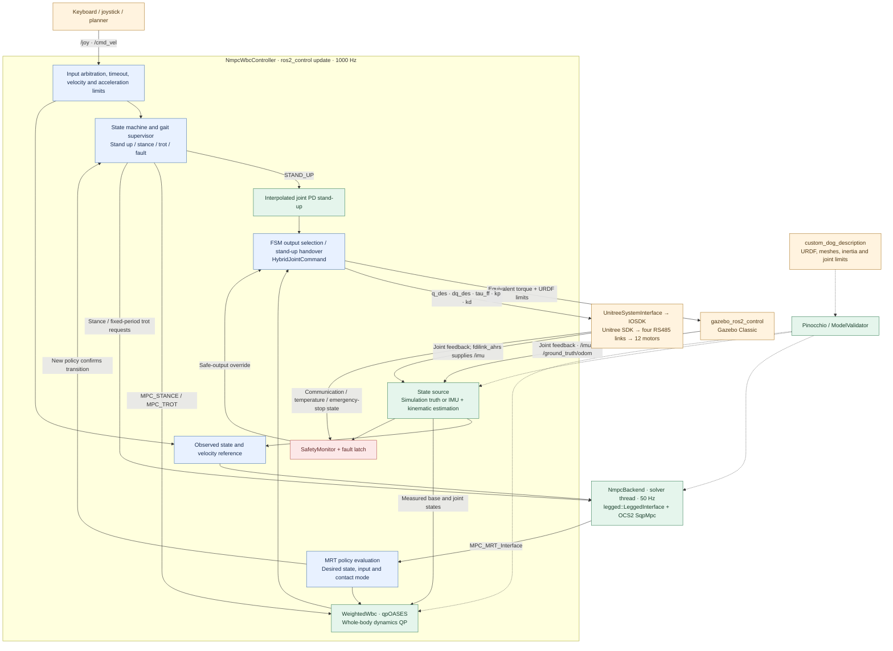

# Dog-control · Traditional NMPC / WBC Locomotion

[简体中文](README.md) | **English**

Traditional locomotion control for a custom 12-DoF quadruped: **ROS 2 Humble + OCS2 NMPC + weighted WBC + Pinocchio**. Simulation and hardware share the controller implementation. The target OS is Ubuntu 22.04, with x86_64 development and an ARM64 Orange Pi 5 Plus hardware target.

This repository maintains traditional NMPC/WBC control. RL policies, the RL hardware controller and NX deployment tools live in [himloco_custom_dog/deployment](https://github.com/hsc13576717115/himloco_custom_dog/tree/master/deployment). That workspace has its own hardware plugin and does not depend on this repository.

## Repository responsibilities

| Development area | Repository / location | Documentation |
| --- | --- | --- |
| Traditional estimation, NMPC, WBC and gait state machine | **This repository**, `src/custom_dog_control` | [Controller architecture](src/custom_dog_control/README.md) |
| Traditional simulation, serial and IMU integration | **This repository**, launch, hardware, `fdilink_ahrs` / `serial_ros2` | [Setup](docs/setup.md) · [Hardware](docs/hardware.md) |
| RL training, refinement, evaluation and export | [himloco_custom_dog](https://github.com/hsc13576717115/himloco_custom_dog) | [English training README](https://github.com/hsc13576717115/himloco_custom_dog/blob/master/README_EN.md) |
| RL hardware control and Jetson Orin NX deployment | `himloco_custom_dog/deployment/ros2_ws` | [Deployment README](https://github.com/hsc13576717115/himloco_custom_dog/blob/master/deployment/README.md) |

The former `src/custom_dog_rl` package and RL-specific build switch have been removed. Traditional control retains its own motor plugin, IMU driver and shared fixes such as AHRS orientation freshness checks. The two controllers use separate installation directories and must not control the same motors simultaneously. They can share the source URDF/meshes without loading RL policies or a training environment into traditional control.

Linked detailed guides currently use Chinese; this page provides the English workspace overview and operating commands.

## Validation status

[](docs/media/custom-dog-platform-demo.mp4)

Flat-ground simulation has exercised standing up, standing, trotting and stopping. Physical communication, state estimation and walking still require staged acceptance. Historical speed-envelope and terrain results are in the [validation baselines](docs/validation-baselines.md). See [2026-09-29](docs/simulation-validation-20260929.md) for recent basic flat-ground regression and [2026-09-23](docs/simulation-validation-20260923.md) for architecture/dependency migration checks.

After removing RL on 2026-10-08, the traditional controller rebuilt successfully and all six CTest groups passed. That migration did not rerun the complete Gazebo motion acceptance suite or establish additional hardware validation.

## Quick start

Recommended layout:

```text
Dog/
├── Dog-control/                     # Traditional control
│   ├── src/                        # Controller and drivers
│   ├── external/                   # Separate dependency workspaces
│   │   ├── ocs2_ws/                # OCS2 source and build products
│   │   └── model_ws/               # Generated model package and build products
│   ├── docs/
│   └── build/, install/, log/      # Main workspace outputs
└── himloco_custom_dog/              # RL project and source robot assets
```

Clone into sibling directories. If you already have a robot description package, you can clone only Dog-control and set `CUSTOM_DOG_DESCRIPTION_DIR` instead:

```bash
mkdir -p Dog
cd Dog
git clone https://github.com/hsc13576717115/Dog-control.git
git clone https://github.com/hsc13576717115/himloco_custom_dog.git
git -C himloco_custom_dog lfs install --local
git -C himloco_custom_dog lfs pull --include='assets/custom_dog_description/**'
cd Dog-control
```

Follow [setup](docs/setup.md) to install system dependencies and build OCS2 first. Run the remaining commands from this repository's root:

```bash
# Prepare the model, build and launch; two compilation jobs by default
src/custom_dog_control/scripts/build_simulation.sh

# Build only
CUSTOM_DOG_BUILD_ONLY=1 src/custom_dog_control/scripts/build_simulation.sh

# Launch an existing build without recompiling
src/custom_dog_control/scripts/run_simulation.sh

# No GUI or keyboard
src/custom_dog_control/scripts/run_simulation.sh gui:=false start_keyboard:=false
```

The script copies the robot assets from the sibling RL repository and generates a Gazebo point-foot URDF in a separate underlay. It removes thigh/calf collision bodies while retaining the canonical model, mass, inertia, visuals and joint limits. Source assets are not modified. Any build failure stops execution instead of launching stale outputs.

Load the environment in other terminals before using ROS commands:

```bash
source src/custom_dog_control/scripts/env.sh
ros2 topic list
```

`env.sh` sources ROS → model → OCS2 → controller workspace, preserving the caller's shell options. Source entry scripts locate the workspace relative to themselves and can be invoked from another directory. Rebuild generated outputs after relocating the workspace because they can contain absolute paths.

### Keyboard controls

Use the terminal running the simulation:

| Key | Action |
| --- | --- |
| `1` | PASSIVE; acknowledge reset after FAULT |
| `2` | Stand up and enable NMPC-WBC; calibrate first on hardware |
| `W / S` | Increase / decrease forward velocity |
| `A / D` | Increase / decrease lateral velocity |
| `J / L` | Increase / decrease yaw rate (`Q / E` are aliases) |
| `Space` / `X` | Zero the command, decelerate within limits and return to standing |
| `Esc` | Software FAULT emergency stop |
| `Ctrl+C` | Close the simulation |

Each velocity key changes the command by 5% of its corresponding limit. Nonzero commands enter Trot after threshold and dwell conditions are met. To run the keyboard separately, launch with `start_keyboard:=false`, source the environment in another terminal and run `ros2 run custom_dog_control keyboard_teleop.py`. Both terminals must use the same `ROS_DOMAIN_ID`.

## Development and validation

After a build-only run, execute unit and contract tests:

```bash
source src/custom_dog_control/scripts/env.sh
colcon test --packages-select custom_dog_control --event-handlers console_direct+
colcon test-result --verbose
```

Coverage includes model/coordinate/joint ordering, gait phase, velocity limits, calibration, safety latching, upstream provenance and total torque continuity when handing over from standing PD to WBC. With testing enabled, a missing canonical URDF is an error instead of silently skipping model checks.

Run the complete basic simulation regression:

```bash
src/custom_dog_control/scripts/test_simulation.sh

# Or select one scenario; the output directory must not already exist
src/custom_dog_control/scripts/test_simulation.sh \
  --scenario motion --output-dir log/my-motion-run
```

- `motion`: stand up → move forward for 12 seconds → stop; check mode, displacement, attitude and WBC.
- `matrix`: forward, lateral and turning segments, including standing after each stop.
- Default `all`: cold-start Gazebo separately for each scenario, with GUI/RViz/keyboard disabled.
- Default isolation: ROS domain `97`, localhost-only communication and a dynamically selected Gazebo master port. Use `--domain-id` with another unused domain for concurrent runs.
- Output: `log/simulation/<timestamp>/`, with per-scenario `launch.log`, `test.log`, `result.json` and a top-level `summary.json`.
- Failures/timeouts return a nonzero exit code. Cleanup only terminates process groups created by that run. Set `--startup-timeout` and `--test-timeout` in seconds as needed.

Basic regression does not cover high-speed envelopes, terrain or physical hardware. Separate tests and their scope are documented in the [validation baselines](docs/validation-baselines.md).

## Software architecture

```text
src/custom_dog_control/
├── include/custom_dog_control/   # Types, controller interfaces and pure computations
├── src/controller/              # Main loop, lifecycle, inputs, FSM, hardware and diagnostics
├── src/nmpc/                    # OCS2 backend, model validation and state estimation
├── src/safety/                  # Validity, timeout, limits and fault latching
├── src/hardware/                # Unitree motor communication and ros2_control plugin
├── config/                     # Controller/NMPC settings and dependency versions
├── launch/                     # Gazebo and hardware launches
├── scripts/                    # Workspace entry points and simulation acceptance
├── test/                       # Unit, model and provenance tests
└── third_party/                 # Pinned upstream algorithms and qpOASES
```

`fdilink_ahrs` and `serial_ros2` provide IMU/serial support. `unitree_guide` is historical reference code excluded by `COLCON_IGNORE`. Frequencies in the diagram are default configuration targets.



Solid arrows show runtime data/control flow; dashed arrows show model dependencies. Simulation and physical hardware are alternative backends. Simulation defaults to `use_sim_ground_truth: true`; hardware uses an IMU/kinematic Kalman filter driven by joint feedback and planned contact phases. `joint_state_broadcaster` publishes `/joint_states`, while the controller reads ros2_control state interfaces directly. The controller publishes odometry, base TF, control mode, contact plans and diagnostics. Algorithm details and transitions are in the [controller architecture](src/custom_dog_control/README.md#算法链路).

Files are split by responsibility but share one controller lifecycle instance. See [architecture and maintenance](docs/architecture.md) for parameters, threads, state machines, interfaces and model contracts.

| Change area | Entry relative to `src/custom_dog_control/` |
| --- | --- |
| Stand-up / stance / trot transitions | `src/controller/ControllerStateMachine.cpp` |
| Input timeout and arbitration | `src/controller/ControllerInputs.cpp` |
| Parameters and validation | `config/controllers.yaml` + `src/controller/ControllerLifecycle.cpp` |
| NMPC / WBC integration | `src/nmpc/NmpcBackend.cpp` + `config/nmpc/task.info` |
| Observation diagnostics | `src/controller/ControllerDiagnostics.cpp` |
| Hardware communication and calibration | `src/hardware/` |

## Configurable paths

Set these before running scripts or sourcing the environment. Use absolute paths for overrides:

| Environment variable | Default / meaning |
| --- | --- |
| `CUSTOM_DOG_DESCRIPTION_DIR` | Sibling `himloco_custom_dog/assets/custom_dog_description` source package |
| `CUSTOM_DOG_MODEL_WS` | This repository's `external/model_ws` |
| `CUSTOM_DOG_CONTROL_DEPS_WS` | This repository's `external/ocs2_ws`; an installation prefix is also supported |
| `CUSTOM_DOG_BUILD_ONLY` | `1` exits after building |
| `CMAKE_BUILD_PARALLEL_LEVEL` | `2`; reduce to `1` when memory is limited |

`env.sh`, build/launch/regression scripts and `fetch_ocs2.sh` are source-workspace entry points invoked by path. Runtime tools such as `keyboard_teleop.py`, `simulation_*_test.py` and `profile_runtime.py` use `ros2 run`.

Build, install and log outputs are ignored by Git. The two generated dependency workspaces under `external/` are also excluded; see [external/README.md](external/README.md) for reconstruction. `external/COLCON_IGNORE` prevents the main workspace from discovering those packages recursively; dependencies build in their own workspaces.

## Hardware and dependency provenance

Recompile on the ARM64 target. Physical state estimation, RS485 timing for all 12 motors and the emergency-stop circuit require separate acceptance; simulation results with ground-truth feedback do not establish hardware performance. Build flags, calibration conventions and commissioning steps are in [hardware setup](docs/hardware.md).

- Pinned versions: [dependencies.lock.yaml](src/custom_dog_control/config/dependencies.lock.yaml).
- Upstream hashes: [legged_control_upstream.sha256](src/custom_dog_control/config/legged_control_upstream.sha256).
- This package and vendored `legged_control` / WBC use BSD-3-Clause; qpOASES uses LGPL-2.1. See the corresponding third-party licenses.
- Pre-migration code is retained under the `pre-ros2-nmpc-wbc` tag. See also the [package README](src/custom_dog_control/README.md).
