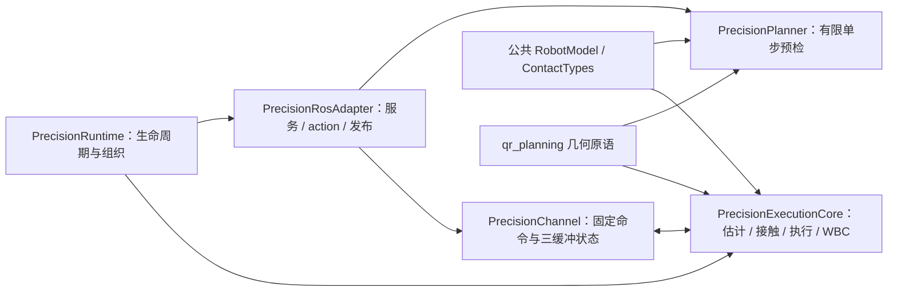

# 软件架构与维护入口

控制器插件仍是一个 `ros2_control::ControllerInterface` 生命周期实例，内部状态由它持有；
按职责拆分实现文件，避免把高频链路分散到额外节点。仿真和真机使用同一套 NMPC/WBC。

下图描述原速度控制链路。`RC2027` 分支新增独立启用的 QR 精确换步模式：
`PrecisionRuntime` 在同一控制插件内执行接触估计、单步阶段和 `PrecisionWbc`，
此模式不启动 NMPC 求解线程，禁止真实硬件和基座真值输入。
控制输入为 IMU 与关节 q/dq/effort，机器人没有足底传感器。
详见 [QR 架构与验收状态](qr/README.md)；后续感知依赖来源见 [MID360 / FAST-LIO](qr/perception-source.md)。

```text
/imu + 关节反馈 ──> KinematicStateEstimator ──> observation
Gazebo ground truth ────────────────────────> observation（仿真配置）
/joy、/cmd_vel ──> 输入仲裁/限幅 ──> 状态机与目标参考
                                           │
                         NmpcBackend / OCS2 SQP（50 Hz 线程）
                                           │ policy
                              ros2_control update（1000 Hz）
                                           │
                              WeightedWbc + safety checks
                                           │ HybridJointCommand
                          ┌────────────────┴────────────────┐
                    Gazebo effort                  UnitreeSystemInterface
                                                        RS485
```

## 文件职责

以下路径相对于 `src/custom_dog_control/`：

| 文件或目录 | 负责什么 | 何时修改 |
| --- | --- | --- |
| `src/controller/NmpcWbcController.cpp` | `update()` 周期编排、插件导出 | 修改控制执行顺序 |
| `src/controller/ControllerLifecycle.cpp` | 参数声明/校验、后端与订阅创建、启停 | 新增控制参数或资源 |
| `src/controller/ControllerInputs.cpp` | IMU/真值/手柄/速度回调、输入仲裁 | 接入上层指令 |
| `src/controller/ControllerHardware.cpp` | 接口名称解析、关节读取、混合命令输出 | 修改 ros2_control 接口 |
| `src/controller/ControllerStateMachine.cpp` | 模式切换、起身、Trot 门控、WBC 交接与短暂故障处理 | 修改动作流程 |
| `src/controller/ControllerDiagnostics.cpp` | 10 Hz 诊断、里程计和 TF | 增加观测指标 |
| `include/.../controller/NmpcWbcController.hpp` | 生命周期接口与控制器私有状态 | 与实现文件配套修改 |
| `include/.../control/JointCommandUtils.hpp` | 纯关节 PD、等效力矩与连续力矩交接计算 | 修改混合控制数学逻辑 |
| `src/nmpc/` | 模型验证、状态估计、NMPC 与 WBC 适配 | 修改控制算法或估计器 |
| `src/precision/`、`include/.../precision/` | 仿真精确 WBC、力矩残差接触估计、单步预检和动作执行 | 修改指定落点及承载确认逻辑 |
| `src/nmpc/NmpcBackend.cpp` 内的 `GaitCommandModule` | 运行时接触计划 | 修改步态调度 |
| `src/safety/` | 输入有效性、限位、超时与故障锁存 | 修改安全条件 |
| `src/hardware/` | Unitree 电机协议、串口、方向与标定 | 接入/维护实机 |
| `third_party/` | 固定版本的上游算法 | 升级时同步来源哈希与验证 |

`include/...` 表示 `include/custom_dog_control`。修改参数时同时维护声明、读取校验和 YAML；
不要仅在 YAML 中添加一个运行时不会读取的键。

## 数据与执行边界

- ROS 订阅回调把最新输入写入 `RealtimeBuffer`；`update()` 读取快照。
- 控制周期读取硬件、更新估计和目标参考、交给后端 observation，再读取最新 policy，
  运行状态机/WBC、安全检查并输出命令。NMPC 求解线程通过后端管理，停用时停止。
- Gazebo 把混合命令换算为 `tau_ff + kp*(q_des-q) + kd*(dq_des-dq)` 并限幅；
  真机将各分量传给电机层。二者共用关节坐标和命令类型。
- 起身交接同时改变目标位置和增益，因此补偿前馈项，确保当前测量状态下的总力矩连续。
  `test_joint_command_utils` 验证交接端点及中间阶段的力矩性质。
- 默认周期为 1000 Hz / 50 Hz；这是配置目标，实际硬件调度和通信时序需独立测量。

## 状态机与故障行为

```text
PASSIVE → CALIBRATION（真机需要重新标定时）→ STAND_UP
                                              ↓
                                         MPC_STANCE ↔ MPC_TROT
                                              ↓
                                            FAULT
```

`STAND_UP` 由关节 PD 插值起身，等待姿态稳定和可用 policy 后交接 WBC。
速度超过进入阈值并满足驻留时间后请求 Trot；归零并满足退出条件后恢复四足站立。
切换等待新 policy，避免接触计划和控制输出错位。

短暂 WBC 无效时使用站立 PD 保持；连续失败达到 `max_consecutive_wbc_failures`
（默认 5 次）进入 FAULT。安全监控中的过期 policy 故障判断针对 `MPC_TROT`；
硬件通信、IMU、关节限位等有各自检查。具体阈值见配置及 `SafetyMonitor`。
FAULT 锁存后需 PASSIVE 确认复位，真机需重新标定。

## 配置定位

| 配置 | 内容 |
| --- | --- |
| `config/controllers.yaml` | 仿真控制频率、限幅、起身、交接、输入超时 |
| `config/real_controller.yaml` | 真机覆盖参数 |
| `config/nmpc/task.info` | NMPC 代价、约束、WBC 设置 |
| `include/.../control/ControlTypes.hpp` | 固定关节/足端顺序、Trot 周期与切换阈值 |
| `config/nmpc/gait.info` | 参考步态配置；当前运行时周期由 C++ 固定常量决定 |
| `config/dependencies.lock.yaml` | 第三方版本 |

## 模型与标定约定

唯一运动学和动力学模型为公共完整 URDF：

```text
/path/to/Dog/Dog-control/external/model_ws/src/custom_dog_description/urdf/custom_dog.urdf
```

碰撞模型按仿真器显式分离，但质量、惯量、视觉、关节树和限位都继承上述公共模型：

| 使用方 | URDF | 碰撞约定 |
| --- | --- | --- |
| 真机、Pinocchio、模型契约 | `custom_dog.urdf` | 完整 primitive 碰撞体 |
| Gazebo 传统控制 | `custom_dog_gazebo_point_foot.urdf` | 去除 thigh/calf 地面碰撞，只保留机身、hip 和足端 |
| HimLoco/Isaac | `custom_dog_selective_collision.urdf` | 标定后的 thigh/calf 代理碰撞体 |

Gazebo launch 必须显式加载点足版本，不能再通过修改公共 URDF 绕开起身阶段的腿段
接触。点足版本仅匹配当前 NMPC/WBC 的四足端接触假设，不代表真实腿部不存在碰撞。

| 项目 | 约定 |
| --- | --- |
| 总质量 | CAD 值 `13.84916 kg` |
| 坐标系 | REP-103：x 向前、y 向左、z 向上 |
| 腿顺序 | `FR、FL、RR、RL` |
| 单腿关节顺序 | `hip、thigh、calf` |
| 接触帧 | `FR_foot、FL_foot、RR_foot、RL_foot` |
| 名义趴姿 | 每腿 `hip=0 deg、thigh=71.8 deg、calf=-161.8 deg` |

运行时 FK、Jacobian、惯量和关节限位均来自 URDF Pinocchio 模型。原 `qr_guide`
的 `RobotModel/LegKinematics` 已退出运行路径，避免旧机械尺寸和旧运动学零点污染模型。

真机按下 START 前，操作者需要将四条腿置于名义趴姿。START 表示“当前机械姿态对应
上述 URDF 角度”：硬件层仅在 12 个电机反馈全部有效时计算零点偏移。该角度是当前
人工折叠姿态的名义值，后续应通过机械基准或标定工装修正；尤其是 hip 的 `0 deg`
不能由贴地几何单独确定。

Gazebo 中看到的趴姿是碰撞和重力稳定后的生成姿态，髋关节会有左右对称的外展；它由
仿真专用 `passive_joint_positions` 描述，不等同于真机 START 建立的逻辑标定角。
二者最终都转换到同一套 URDF 关节坐标后再进入 NMPC-WBC。

## ROS 2 接口

### 输入

| 话题 | 类型 | 用途 |
| --- | --- | --- |
| `/imu` | `sensor_msgs/msg/Imu` | 姿态与角速度测量 |
| `/joy` | `sensor_msgs/msg/Joy` | 手柄状态和速度输入 |
| `/cmd_vel` | `geometry_msgs/msg/Twist` | 上层速度指令 |

非零手柄速度有效时优先于 `/cmd_vel`，两者共用速度和加速度限幅器；仅按模式键且摇杆
保持零位时，不会遮蔽 `/cmd_vel`。

### 输出

- `/joint_states`
- `/odom` 和 TF
- `/nmpc_wbc_controller/control_mode`
- `/nmpc_wbc_controller/contact_plan`
- `/nmpc_wbc_controller/diagnostics`

诊断数据包含 NMPC 状态、WBC 残差、控制周期、求解时间和硬件错误计数。

## 工作区边界

`custom_dog_control` 是主包；`fdilink_ahrs`、`serial_ros2` 是驱动依赖。
`src/unitree_guide` 为历史参考，使用 `COLCON_IGNORE` 排除。
`external/model_ws`、`external/ocs2_ws` 为独立 underlay，不应把生成文件复制回源码。
上游算法固定提交及本地修改由 provenance 测试校验。

## QR 精确控制的内部依赖



箭头表示调用或数据依赖，不代表跨进程通信。规划与执行持有独立 Pinocchio/WBC 缓存；
精确模式不初始化 NMPC 优化问题。旧速度模式保留 NmpcBackend。当前仍复用 OCS2 的
模型类型和 WBC 基础库，不声称已经消除 OCS2 编译依赖。公共模型校验迁到 `model/`，
旧 `nmpc/ModelValidator.hpp` 仅转发以兼容原有引用。

详见 [修改计划](qr/refactoring.md)、[接口及配置](qr/interfaces.md)。
