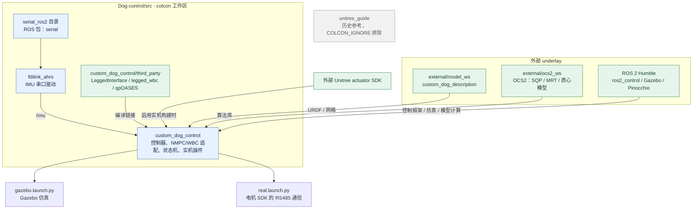

# ROS 2 source packages

该目录由 `colcon` 发现 ROS 2 包，不使用 ROS 1/catkin 顶层构建文件。

- `custom_dog_control`：NMPC、WBC、状态机和 ros2_control 插件。
- `fdilink_ahrs`：IMU 驱动。
- `serial_ros2`：源码目录，对外 ROS 包名为 `serial`。

机器人模型来自外部 underlay 中的 `custom_dog_description` 包。

`unitree_guide` 是历史参考代码，不属于当前 ROS 2 控制运行时。

## 工作区与依赖关系

箭头表示依赖包向使用方提供的能力或数据；`serial_ros2` 是目录名，实际包名为 `serial`。

`serial` 服务于 IMU 驱动；电机通信使用 Unitree SDK 的串口实现。
`third_party` 中的算法随主包编译，并非独立 ROS 节点。

整体闭环见 [工作区 README](../README.md#软件结构)，
求解线程、状态维度和 WBC 实现见 [控制包 README](custom_dog_control/README.md#算法链路)。
