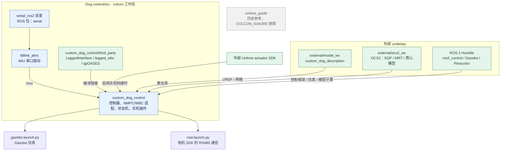

# ROS 2 源码包

**中文** | [English](README_EN.md)

该目录由 `colcon` 发现 ROS 2 包，不使用 ROS 1/catkin 顶层构建文件。

- `custom_dog_control`：NMPC、WBC、状态机和 ros2_control 插件。
- `fdilink_ahrs`：IMU 驱动。
- `serial_ros2`：源码目录，对外 ROS 包名为 `serial`。
- `qr_interfaces`：精确换步的状态、支撑面、计划和动作契约。
- `qr_planning`：安全支撑区、轨迹原语、16 步有限模板和先预检后逐步重规划的 C++ 客户端；M2 配置支持平地前进与四脚低平台转移。
- `qr_course`：规则配置与已知几何测试场景。
- `qr_bringup`：Gazebo 精确换步启动入口。
- `qr_simulation`：每个物理步累计的独立接触滑移评价，不给控制器提供真值。
- `qr_validation`：独立评价、冷启动测试和批量报告。

QR 表示四足开发模块，分支名仍为 `RC2027`。精确模式目前仅用于仿真，
以 IMU 和关节反馈估计接触；机器人没有足底接触传感器。
具体实现与验收状态见 [QR 文档](../docs/qr/README.md)。
后续 MID360 和 FAST-LIO 使用独立的 `external/perception_ws`，
来源和接入边界见 [感知依赖说明](../docs/qr/perception-source.md)。

机器人模型来自外部 underlay 中的 `custom_dog_description` 包。

本目录只维护传统控制包。RL 控制器已迁至
[himloco_custom_dog/deployment/ros2_ws](https://github.com/hsc13576717115/himloco_custom_dog/tree/master/deployment/ros2_ws)，
其 `custom_dog_hardware` 插件独立构建，不作为本工作区的依赖。

`unitree_guide` 是历史参考代码，不属于当前 ROS 2 控制运行时。

## 工作区与依赖关系

箭头表示依赖包向使用方提供的能力或数据；`serial_ros2` 是目录名，实际包名为 `serial`。

`serial` 服务于 IMU 驱动；电机通信使用 Unitree SDK 的串口实现。
`third_party` 中的算法随主包编译，并非独立 ROS 节点。

整体闭环见 [工作区 README](../README.md#软件结构)，
求解线程、状态维度和 WBC 实现见 [控制包 README](custom_dog_control/README.md#算法链路)。
