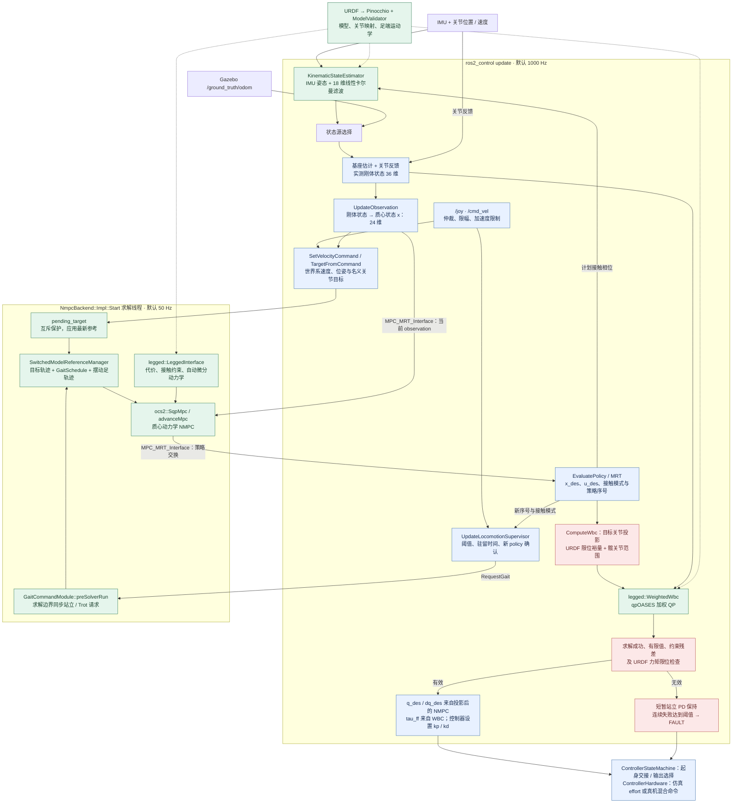
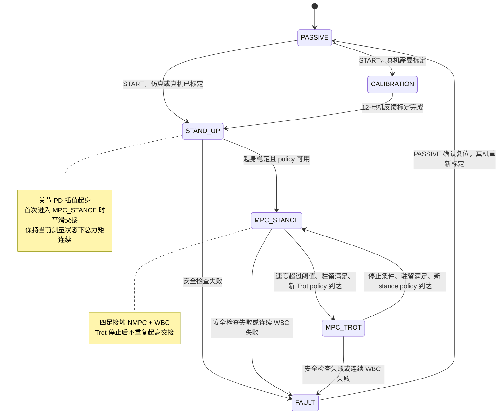

# custom_dog_control

ROS 2 Humble 的四足 NMPC-WBC 控制包，仿真和真机共用一个控制器生命周期实例。

本包专用于传统控制。HIM 策略及真机 RL 接入统一位于
[himloco_custom_dog/deployment](https://github.com/hsc13576717115/himloco_custom_dog/tree/master/deployment)；
这里的 `UnitreeSystemInterface` 继续服务于 NMPC/WBC，RL 工作区使用独立的硬件包。
本包正常构建需要 OCS2；不再提供为 RL 引入的 `CUSTOM_DOG_CONTROL_BUILD_NMPC=OFF` 构建路径。

| 项目 | 入口 |
| --- | --- |
| 控制器插件 | `custom_dog_control/NmpcWbcController` |
| 实机硬件插件 | `custom_dog_control/UnitreeSystemInterface`（启用实机构建时） |
| 主循环 / WBC | 1000 Hz，`src/controller/NmpcWbcController.cpp` |
| NMPC | 50 Hz，`src/nmpc/NmpcBackend.cpp` |
| 控制参数 | `config/controllers.yaml`、`config/real_controller.yaml` |
| 模型 | 外部 `custom_dog_description` 包的规范 URDF |

`src/controller/` 按生命周期、输入、状态机、硬件接口和诊断拆分。
`include/custom_dog_control/control/JointCommandUtils.hpp` 提供不依赖 ROS 的 PD、等效力矩和交接计算。
上游 `LeggedInterface` / `WeightedWbc` 固定版本直接参与构建，并用来源哈希测试校验。

## 算法链路

下图展开 `MPC_STANCE` / `MPC_TROT` 的计算过程。两个执行区域属于同一控制器进程，
NMPC 在后端独立线程运行，WBC 在 ros2_control 的 `update()` 中同步计算。



实线为数据/控制流，虚线为模型依赖；状态源二选一。图中 50 Hz 指 NMPC 求解频率，
运动目标参考由主循环以不快于 20 Hz 更新，站立重锚定及运动停止还会触发事件更新。
站立策略评估采用其前馈输入，Trot 保留 SQP 策略反馈；主循环随后通过
`policy_buffer_` 保存最近有效的 `PolicySample`。

### 优化问题与状态估计

| 环节 | 当前实际实现 |
| --- | --- |
| 状态估计 | IMU 提供姿态/角速度；18 维滤波状态为基座位置 3、速度 3、四足世界坐标 12；使用计划接触相位调整观测噪声 |
| NMPC 状态 `x` | 24 维：归一化质心动量 6 + 基座位置/ZYX 姿态 6 + 关节位置 12 |
| NMPC 输入 `u` | 24 维：四足接触力 12 + 关节速度 12 |
| NMPC 求解 | `LeggedRobotDynamicsAD` + `ocs2::SqpMpc`；跟踪代价、摩擦锥硬约束、摆动足零力、支撑足零速度、足端法向速度约束和自碰撞软约束 |
| 步态 | 固定 0.25 s、50% 占空比 Trot，FR+RL / FL+RR 交替；零速退出到四足站立；周期来自 `ControlTypes.hpp` |
| WBC 决策变量 | 广义加速度 18 + 足端力 12 + 关节力矩 12 + 关节限位松弛量 24，共 66 维 |
| WBC 约束 | 全身动力学等式、力矩限位、带松弛的预测关节限位、摩擦锥、摆动足零力、支撑足零加速度 |
| WBC 加权目标 | 摆动足加速度、基座加速度、接触力跟踪、关节限位松弛惩罚 |
| 混合输出 | `tau = tau_ff + kp*(q_des-q) + kd*(dq_des-dq)`；Gazebo 换算并限幅为 effort，真机通过电机 SDK 下发各分量 |

WBC 返回的力矩用于前馈，关节目标来自 NMPC 的限位投影结果；WBC 加速度解并不被积分为关节目标。
当前采用 `WeightedWbc`，仓库中的 `HierarchicalWbc` 不参与运行时求解。
状态估计没有真实触地传感器反馈；摆动足参考仍采用平地高度假设。

模型加载优先级为控制器参数 `robot_description` → `urdf_file` → 模型包的
`urdf/custom_dog.urdf`。Gazebo 使用从规范模型派生的点足碰撞版本，真机使用规范模型；
二者保留相同质量、惯量、运动学和关节限位。

## 模式与输出选择



图中省略通用操作：任意模式可由软件 ESTOP 进入 FAULT；活动模式可由 PASSIVE 请求返回被动状态。
`SafetyMonitor` 在 STAND_UP / MPC_STANCE / MPC_TROT 中运行，其中策略过期/求解器失效检查
仅对 MPC_TROT 生效。连续 WBC 失败阈值默认 5 次；未达到阈值时使用站立 PD 保持。
PASSIVE / CALIBRATION / FAULT 或无法生成有效状态机输出时调用 `WriteSafeCommand()`：
通常输出安全阻尼，仿真 PASSIVE 可按配置保持趴姿。

## 实现文件对应关系

| 图中职责 | 实现入口 |
| --- | --- |
| 主周期编排 | [NmpcWbcController.cpp](src/controller/NmpcWbcController.cpp) |
| 参数、模型与资源生命周期 | [ControllerLifecycle.cpp](src/controller/ControllerLifecycle.cpp) |
| 回调缓冲、指令仲裁与限幅 | [ControllerInputs.cpp](src/controller/ControllerInputs.cpp) |
| 步态监督、状态机、PD/WBC 输出选择 | [ControllerStateMachine.cpp](src/controller/ControllerStateMachine.cpp) |
| ros2_control 状态读取与命令写入 | [ControllerHardware.cpp](src/controller/ControllerHardware.cpp) |
| 10 Hz 诊断、里程计与基座 TF | [ControllerDiagnostics.cpp](src/controller/ControllerDiagnostics.cpp) |
| NMPC 线程、MRT、参考与 WBC 适配 | [NmpcBackend.cpp](src/nmpc/NmpcBackend.cpp) |
| 运动学与卡尔曼融合 | [KinematicStateEstimator.cpp](src/nmpc/KinematicStateEstimator.cpp) |
| WBC 加权 QP / 任务与约束 | [WeightedWbc.cpp](third_party/legged_wbc/src/WeightedWbc.cpp)、[WbcBase.cpp](third_party/legged_wbc/src/WbcBase.cpp) |
| 安全检查与锁存 | [SafetyMonitor.cpp](src/safety/SafetyMonitor.cpp) |

## 开发入口

从源码工作区根目录使用：

```bash
CUSTOM_DOG_BUILD_ONLY=1 src/custom_dog_control/scripts/build_simulation.sh
src/custom_dog_control/scripts/run_simulation.sh
src/custom_dog_control/scripts/test_simulation.sh
```

开发工具需在源码工作区运行；运行工具可在加载环境后调用：

```bash
source src/custom_dog_control/scripts/env.sh
ros2 run custom_dog_control keyboard_teleop.py
```

源码文档：

- [工作区 README](../../README.md)：安装、构建、启动、键盘和测试。
- [架构与维护入口](../../docs/architecture.md)：职责、执行边界、配置、状态机和模型契约。
- [真机说明](../../docs/hardware.md)：ARM64 构建及硬件验收。
- [验收基线](../../docs/validation-baselines.md)：完整包线和地形测试。

以上相对链接适用于源码仓库；安装后的 `share/custom_dog_control/README.md` 请结合源码阅读。

## QR 精确模式

`precision_enabled` 默认关闭。仅 Gazebo 下允许启用，使用 IMU、关节 q/dq/effort 推断接触，无足底传感器输入。原 NMPC 速度模式保留，精确模式使用显式参考 WBC，不启动在线 NMPC。入口和实际验证状态见 [QR 文档](../../docs/qr/README.md)。
